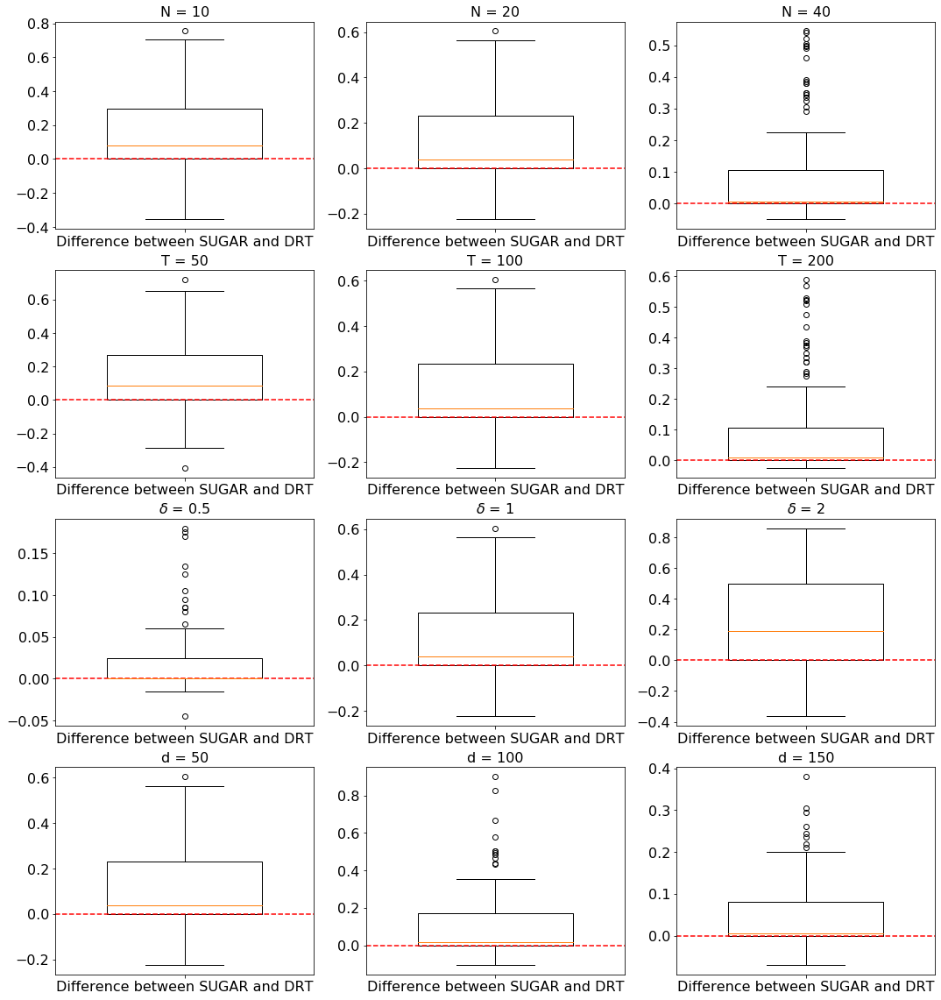

# Testing Directed Acyclic Graph via Structural, Supervised and Generative Adversarial Learning

This repository contains the implementation for the paper [Testing Directed Acyclic Graph via Structural, Supervised and Generative Adversarial Learning](https://arxiv.org/pdf/2106.01474.pdf) in Python. 

## Summary of the paper

In this article, we propose a new hypothesis testing method for directed acyclic graph (DAG). While there is a rich class of DAG estimation methods, there is a relative paucity of DAG inference solutions. Moreover, the existing methods often impose some specific model structures such as linear models or additive models, and assume independent data observations. Our proposed test instead allows the associations among the random variables to be nonlinear and the data to be time-dependent. We build the test based on some highly flexible neural networks learners. We establish the asymptotic guarantees of the test, while allowing either the number of subjects or the number of time points for each subject to diverge to infinity. We demonstrate the efficacy of the test through simulations and a brain connectivity network analysis.   

**Figures**:  

| Size | Power | Power Difference |
| :-------:    |  :-------: |  :-------: |
|    |   |   

## Requirement

+ Python 3.6
    + numpy 1.18.5
    + scipy 1.5.4
    + torch 1.0.0
    + tensorflow 2.1.3
    + tensorflow-probability 0.8.0
    + sklearn 0.23.2

+ R 3.6.3
    + clrdag (https://github.com/chunlinli/clrdag)

## File Overview
- `SUGAR/`: This module contains all python function used in numerical simulations and real data analysis.
  - `nonlinear_learning.py` is used for structural learning of the graphs. (Refers to https://github.com/xunzheng/notears)
  - `inference.py` contains the major functions to implement DAG structure learning and p value calculation for simulations.
  - `infer_utils.py` contains the helper functions for p value calculation in simulations.
  - `real_infer.py` contains the major functions to implement DAG structure learning and p value calculation for the real data analysis.
  - `sim_gen.py` contains the utils functions to generate data for simulations and is sourced to implement the LRT.
  - `synthetic.py` contains the helper functions to generate the graph matrix for simulations.
  - `utils_tools.py` provides the helper function for the GAN with Sinkhorn divergence.
  - `utils.py` provides the other utility functions.
- `data/`: This folder where the output results and the dataset should be put.
  - `module_name.npy` records the information of the electrode names. 
  - `data_process.R` implements the preprocessing of the raw real dataset.
- `main.py` is the main function to reproduce the simulation results in section 5 of the paper.
- `main_real.py` is the main function to implements the real data analysis in section 6 of the paper.
- `main_lrt.R` is to implement the methods in ["Likelihood ratio tests for a large directed acyclic graph"](https://www.ncbi.nlm.nih.gov/pmc/articles/PMC7508303/)
- `plot.py` is used to load test results and draw plots for the simulations.
## Workflow

- Follow the steps below in order to reproduce the simulations of this paper:
    -  Run `main.py` to implement SUGAR and DRT for the simulations.
    -  Run `main_lrt.R` to implement LRT for the simulations.
    -  Run `plot.py` to reproduce the figures of the sensitivity analysis.

- We also provide a toy example in `example.ipynb` which is feasible to run on a local computer and reproduces the case of $\delta=0.5$ in Figure 2 of the main paper. It is tested to take around 12 hours to run on a standard single CPU machine. If you are out of patience, you can also reduce the number of repetitions in the simulations to speed it up.

- Follow the steps below in order to reproduce the real data analysis of this paper:
    -  Put the HCP data into the "data" folder. This dataset can be requested at https://www.humanconnectome.org/study/hcp-young-adult after signing the data user agreement.
    -  Navigate to the `data` folder and run `data_process.R` to preprocess the dataset.
    -  Run `main_real.py` to implement the DAG testing for HCP data.

## Data Description

The dataset we analyze is part of the Human Connectome Project (HCP, Van Essen et al., 2013), whose overarching objective is to understand brain connectivity patterns of healthy adults. We study the fMRI scans of a group of individuals who undertook a story-math task. The task consisted of blocks of auditory stories and addition-subtraction calculations, and required the participant to answer a series of questions. An accuracy score was given at the end. We analyze two subsets of individuals with matching age and sex. One set consists of N = 28 individuals who scored below 65 out of 100, and the other set consists of N = 28 individuals who achieved the perfect score of 100. All fMRI scans have been preprocessed following the
pipeline of Glasser et al. (2013) that summarized each fMRI scan as a matrix of time series. Each row is a time series with length T = 316, and there are 264 rows corresponding to 264 brain regions (Power et al., 2011). Those brain regions are further grouped into 14 functional
modules (Smith et al., 2009). Each module possesses a relatively autonomous functionality,
and complex tasks are believed to perform through coordinated collaborations among the mod-
ules. In our analysis, we concentrate on d = 127 brain regions from four functional modules:
auditory, visual, frontoparietal task control, and default mode, which are generally believed to
be involved in language processing and problem solving domains (Barch et al., 2013).

The HCP fMRI data is publicly available at https://www.humanconnectome.org/study/hcp-young-adult. To access the dataset, you are required to sign the data user agreement.

## Computational Time
For the simulations, we implemented the DAG estimation step on the NVIDIA Tesla T4 GPU, and it took about 5 to 20 minutes when $d$ ranges from 50 to 150 for one data replication. We implemented the rest of the testing procedure on the N1 standard CPU, and it took about 2 minutes for one data replication. For the real data application, it took about 30 hours to test every edge in this large $127 \times 127$ network.  

## References
[1] Barch, D. M., Burgess, G. C., et al. (2013). Function in the human connectome: Task-fmri and
individual differences in behavior. NeuroImage, 80:169 – 189. Mapping the Connectome.

[2] Glasser, M. F., Sotiropoulos, S. N., et al. (2013). The minimal preprocessing pipelines for the
human connectome project. Neuroimage, 80:105–124.

[3] Power, J. D., Cohen, A. L., et al. (2011). Functional network organization of the human brain.
Neuron, 72(4):665–678.

[4] Smith, S. D., Fox, P. T., Miller, K., Glahn, D., Fox, P., Mackay, C. E., Filippini, N., Watkins,
K. E., Toro, R., Laird, A., and Beckmann, C. F. (2009). Correspondence of the brain;
functional architecture during activation and rest. Proceedings of the National Academy of
Sciences of the United States of America, 106:13040–5.

[5] Van Essen, D. C., Smith, S. M., Barch, D. M., Behrens, T. E., Yacoub, E., Ugurbil, K., Con-
sortium, W.-M. H., et al. (2013). The wu-minn human connectome project: an overview.
Neuroimage, 80:62–79.

